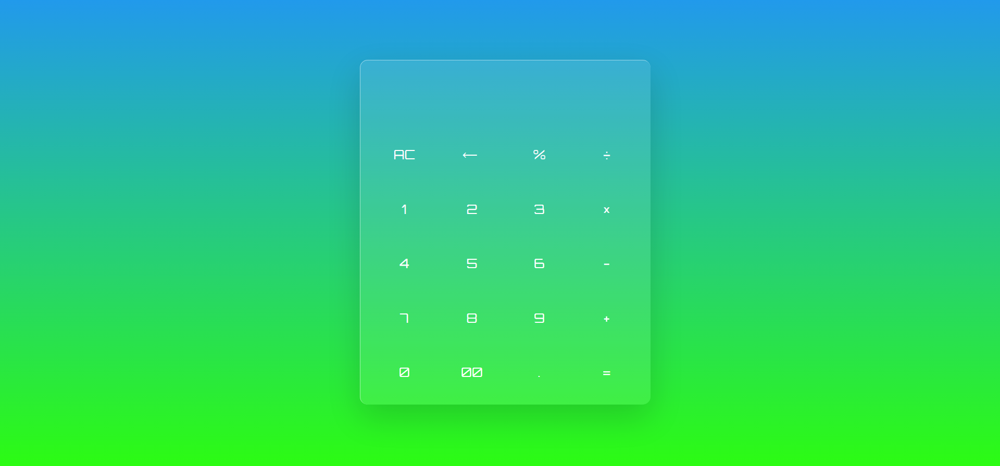

# Calculator App

## Features

- Addition (+)
- Subtraction (-)
- Multiplication (*)
- Division (/)
- Clear button (AC)
- Backspace button (<-)
- Responsive design

## Screenshot

## Acknowledgments

This calculator project was created as a learning exercise and is inspired by various online resources and tutorials. Special thanks to the web development community for sharing knowledge and making projects like this possible.

## Author

Shehzan Ahmed Sheikh

## Contact

If you have any questions or suggestions, you can reach out to me at sshahzan0@gmail.com.

Enjoy using this calculator and happy coding!
